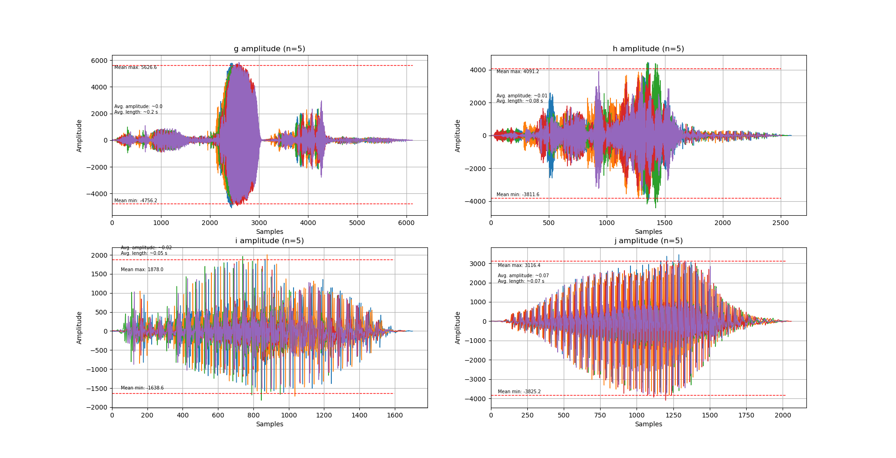
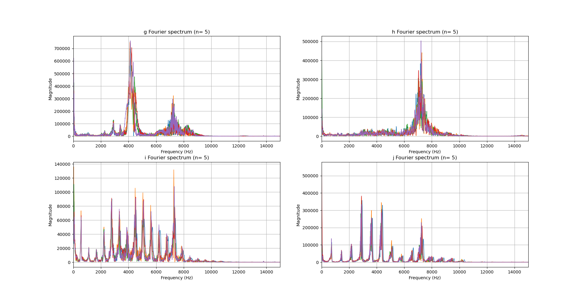
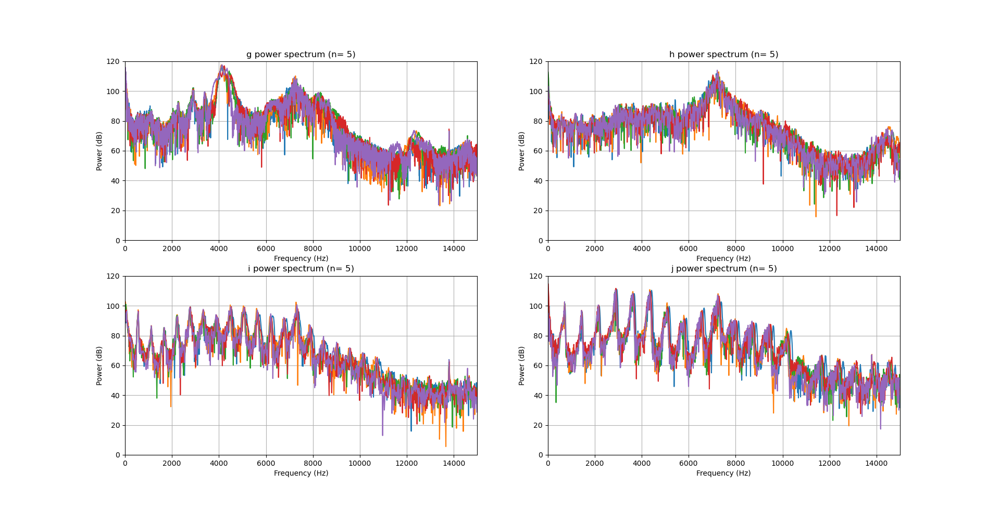
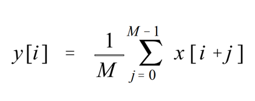

<h1>Syllable Detection</h1>
A single bird recording can be hours in length but only contain a couple minutes of song.

The file sizes of these recordings can be on the GB scales. Feeding such dat

Here I made a clever syllable detection algorithm using:

<ol>
    <li>Zero phase filtering.</li>
    <li>Moving average filters.</li>
    <li>Average amplitude values of syllables.</li>
    <li>Average Fourier / power spectrum of syllables </li>
</ol>

<h2>Syllable Characteristics (G,H,I,J) </h2>

<h2>Filtering</h2>
To denoise the original signal without introducing phase distortion, I implemented forwards-backwards filtering using a high pass filter. My choice of filter was an 8th order Chebyshev II filter. The cutoff frequency was chosen to be 320 Hz, with a minimum attenuation of -30 dB.  

The reasoning behind this choice is because the Chebyshev filter has a steeper transition band, and perfectly preserves the pass band while greatly attenuating lower frequency noise.
  
 

<h2>Moving Average</h2>
In this section, a mask of the original audio waveform was created using two moving average filters: P_short, P_long, with window sizes of 50 ms and 250 ms respectively.
<ol>
    <li>When the magnitude of P_short was greater than P_long by a threshold value of 30, it was labeled as an area of interest.</li>
    <li>If the total length of said area is less than 40 ms, then it was removed.</li>
    <li>If areas were within 400 ms of one another, they were concated into the same area.</li>
    <li>This mask was then applied to the waveform.</li>
</ol>
 
  

Below is the general form of a moving average filter:
 

<h2>Cutting</h2>
Using the mask created in the previous step, a "cut" version of the audio waveform was generated. Since we know what the amplitudes and Fourier spectrum of the syllables that we want, we can filter this cut data.

 
 
 
